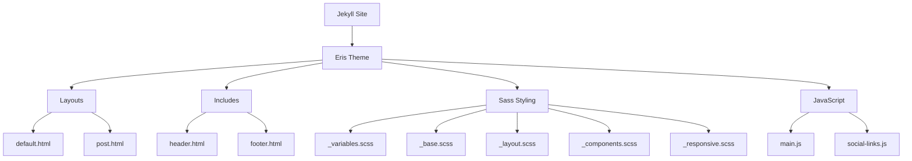
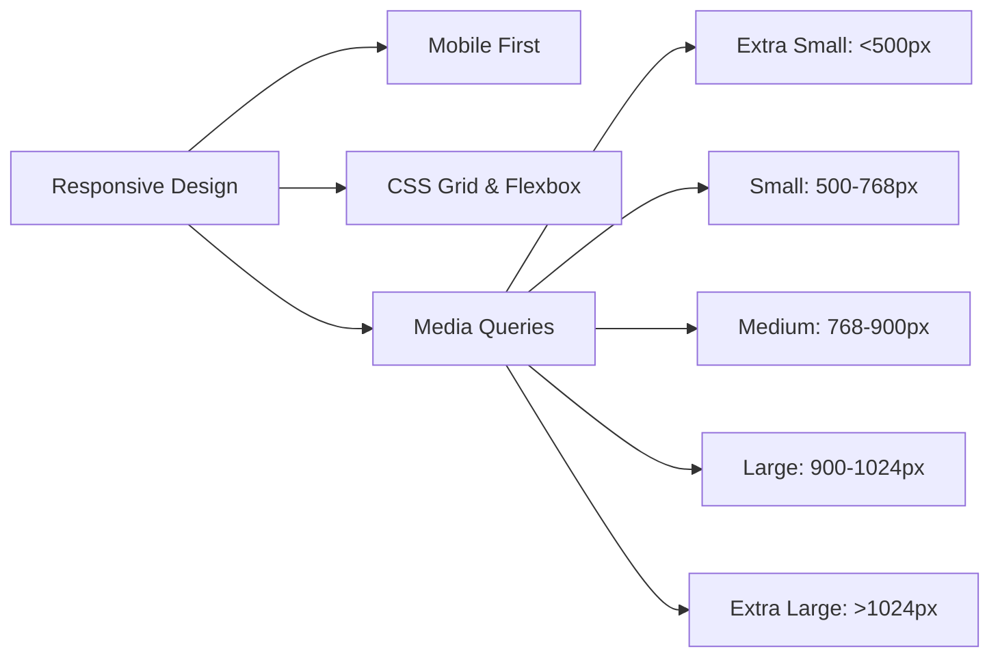
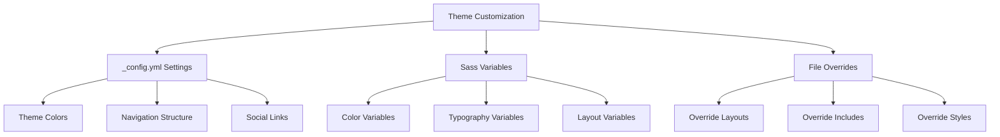
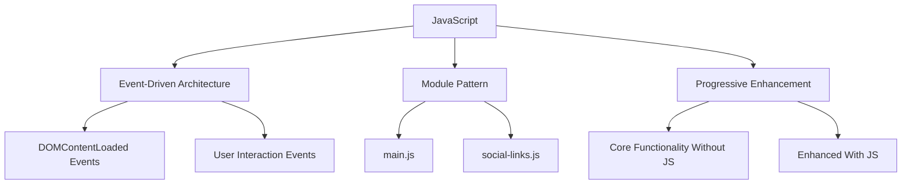
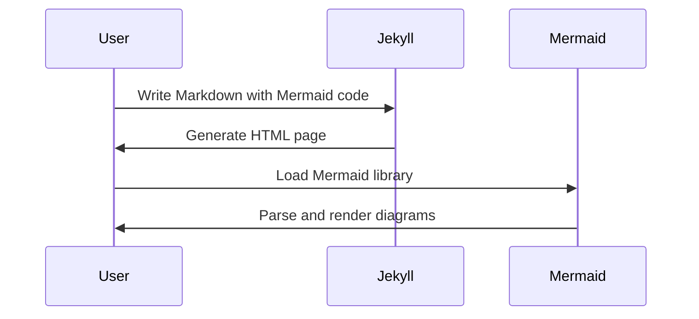

# Eris Jekyll Theme

Eris is a modern, minimalist Jekyll theme with a distinctive purple color scheme and unique border styling. It features a responsive design, dropdown navigation, social media integration, and built-in support for Mermaid diagrams.


## Technical Overview

Eris is built with a modular architecture that separates concerns and makes customization straightforward. The theme leverages Sass for styling, vanilla JavaScript for interactivity, and Jekyll's templating system for content management.



### Directory Structure

```
eris-theme/
├── _includes/              # Reusable components
│   ├── footer.html         # Site footer
│   └── header.html         # Site header with navigation
├── _layouts/               # Page templates
│   ├── default.html        # Base layout
│   └── post.html           # Blog post layout
├── _sass/                  # Sass partials
│   ├── _base.scss          # Base styles
│   ├── _components.scss    # UI components
│   ├── _layout.scss        # Layout components
│   ├── _responsive.scss    # Responsive design
│   ├── _variables.scss     # Theme variables
│   └── eris.scss           # Main Sass file
├── assets/
│   ├── css/
│   │   ├── fonts.css       # Font definitions
│   │   └── main.scss       # Main stylesheet
│   ├── fonts/              # Web fonts
│   └── js/
│       ├── main.js         # Main JavaScript
│       └── social-links.js # Social media integration
├── _config.yml             # Theme configuration
├── .gitignore              # Git ignore file
├── Gemfile                 # Gem dependencies
├── INSTALL.md              # Installation guide
├── LICENSE.txt             # MIT license
├── package.json            # npm package configuration
├── README.md               # This file
└── setup.sh                # Setup script
```

## Technical Features

### 1. Responsive Design Architecture

The theme uses a mobile-first approach with carefully crafted breakpoints:



### 2. Theme Customization System

Eris uses a robust variable system that makes customization straightforward:



### 3. JavaScript Architecture

The theme's JavaScript is organized for maintainability and performance:



### 4. Mermaid Diagram Integration

The theme includes built-in support for Mermaid diagrams:



## Performance Optimizations

- Minimal CSS with modular architecture
- Vanilla JavaScript with no dependencies
- Optimized font loading strategy
- Responsive images with appropriate sizing
- Lazy-loaded components

## Browser Compatibility

- Chrome (latest 2 versions)
- Firefox (latest 2 versions)
- Safari (latest 2 versions)
- Edge (latest 2 versions)
- Opera (latest 2 versions)

## Contributing

Bug reports and pull requests are welcome on GitHub at https://github.com/radicalkjax/eris-theme.

## License

The theme is available as open source under the terms of the [MIT License](https://opensource.org/licenses/MIT).
