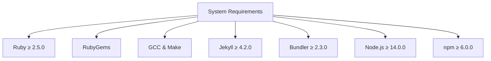
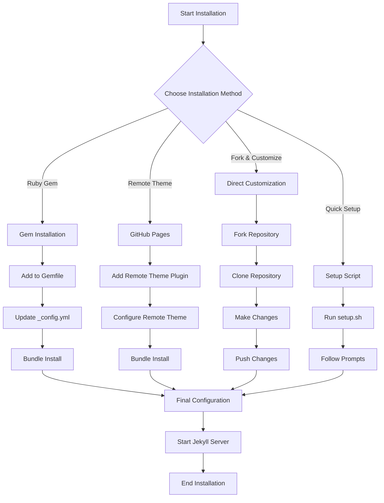
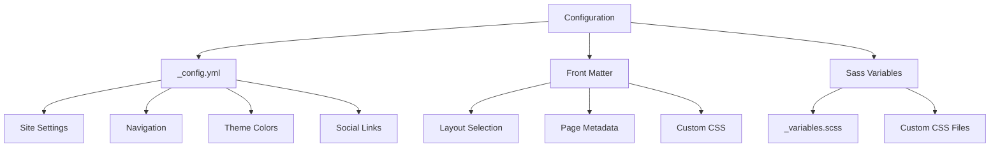
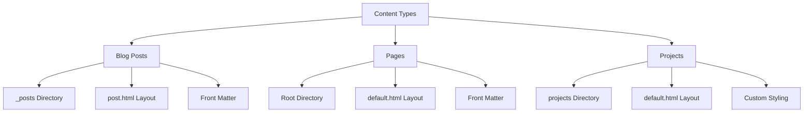
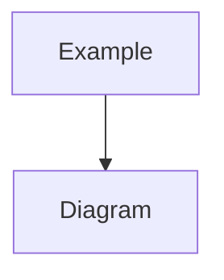
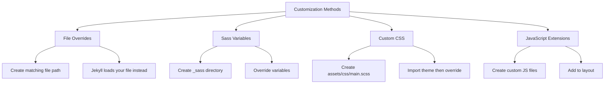
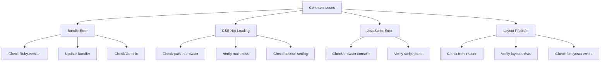

# Technical Installation Guide for Eris Theme

This comprehensive guide will help you install, configure, and customize the Eris theme for your Jekyll site.

## System Requirements



### Detailed Requirements

| Component | Minimum Version | Recommended Version | Purpose |
|-----------|----------------|---------------------|---------|
| Ruby | 2.5.0 | 3.0.0 or higher | Core language for Jekyll |
| RubyGems | Latest | Latest | Package manager for Ruby |
| GCC & Make | Any | Latest | Compile native extensions |
| Jekyll | 4.2.0 | 4.3.0 or higher | Static site generator |
| Bundler | 2.3.0 | 2.4.0 or higher | Dependency manager |
| Node.js | 14.0.0 | 18.0.0 or higher | JavaScript runtime |
| npm | 6.0.0 | 9.0.0 or higher | Package manager for Node.js |

## Installation Workflow



## Installation Methods

### 1. Ruby Gem Installation (Recommended)

This method is ideal for standard Jekyll sites and provides the cleanest integration.

```bash
# Step 1: Add to your Gemfile
echo 'gem "eris-theme"' >> Gemfile

# Step 2: Update _config.yml
echo 'theme: eris-theme' >> _config.yml

# Step 3: Install dependencies
bundle install

# Step 4: Start Jekyll server
bundle exec jekyll serve
```

### 2. GitHub Pages Installation

For GitHub Pages, use the jekyll-remote-theme plugin:

```bash
# Step 1: Add remote theme plugin to Gemfile
echo 'gem "jekyll-remote-theme"' >> Gemfile

# Step 2: Configure in _config.yml
cat << EOF >> _config.yml
plugins:
  - jekyll-remote-theme

   remote_theme: radicalkjax/eris-theme
EOF

# Step 3: Install dependencies
bundle install

# Step 4: Start Jekyll server
bundle exec jekyll serve
```

### 3. Fork and Customize

For extensive customization, fork the repository:

```bash
# Step 1: Fork via GitHub UI

# Step 2: Clone your fork
git clone https://github.com/radicalkjax/eris-theme.git

# Step 3: Navigate to directory
cd eris-theme

# Step 4: Install dependencies
bundle install
npm install

# Step 5: Make your changes
# ...

# Step 6: Test your changes
bundle exec jekyll serve

# Step 7: Commit and push
git add .
git commit -m "Customize Eris theme"
git push origin main
```

### 4. Quick Setup Script

For rapid setup with sample content:

```bash
# Step 1: Make script executable
chmod +x eris-theme/setup.sh

# Step 2: Run setup script
./eris-theme/setup.sh

# Step 3: Follow the prompts
# ...
```

## Technical Configuration

The Eris theme uses a hierarchical configuration system:



### Core Configuration (_config.yml)

```yaml
# Site settings
title: "Your Site Title"
description: "Your site description"
url: "https://yourdomain.com"
baseurl: ""

# Build settings
markdown: kramdown
plugins:
  - jekyll-feed
  - jekyll-seo-tag

# Navigation (hierarchical structure)
navigation:
  - title: Blog
    url: /blog.html
  - title: Projects
    url: /projects.html
    submenu:
      - title: Project 1
        url: /projects/project1.html
      - title: Project 2
        url: /projects/project2.html
  - title: About
    url: /about.html
  - title: Contact
    url: /contact.html

# Theme color settings
theme_color:
  primary: "#6d105a"  # Primary theme color
  text: "#ffffff"     # Text color

# Author information
author:
  name: "Your Name"
  email: "your.email@example.com"
  twitter: "yourtwitter"
  github: "yourgithub"

# Social media links
social:
  bluesky: "https://bsky.app/profile/yourusername"
  linkedin: "https://www.linkedin.com/in/yourusername"
  instagram: "https://www.instagram.com/yourusername"
  github: "https://github.com/yourusername"

# Footer text
footer_text: "© 2025 Your Name. Powered by Eris Theme."
```

## Content Creation Architecture



### Blog Post Structure

```yaml
---
layout: post
title: "Your Post Title"
date: 2025-04-21 12:00:00 -0700
categories: jekyll theme
tags: [jekyll, theme, eris]
image: /path/to/featured-image.jpg  # Optional
excerpt: "Custom excerpt for this post"  # Optional
---

# Your post content in Markdown

Regular paragraph text.

## Subheading

More content...


```

### Page Structure

```yaml
---
layout: default
title: "Your Page Title"
custom_css: |
  .custom-element {
    color: red;
  }
---

<div class="post-card">
  <h1 class="post-title">Your Page Title</h1>
  <div class="post-content">
    <p>Your page content...</p>
  </div>
</div>
```

## Advanced Customization

### Theme Override Architecture



### Overriding Theme Files

To override any theme file, create a file with the same path in your Jekyll site:

```
your-site/
├── _includes/
│   └── header.html  # Overrides eris-theme/_includes/header.html
├── _layouts/
│   └── post.html    # Overrides eris-theme/_layouts/post.html
└── assets/
    └── css/
        └── main.scss # Extends theme CSS
```

### Custom CSS Example

```scss
---
---

// Import the theme
@import "eris";

// Override variables
$primary-color: #8a2be2;
$text-color: #f5f5f5;

// Add custom styles
.custom-component {
  background-color: rgba($primary-color, 0.2);
  border: 1px solid $primary-color;
  padding: 20px;
  margin: 20px 0;
  border-radius: 5px;
}
```

## Troubleshooting



### Common Issues and Solutions

| Issue | Possible Cause | Solution |
|-------|---------------|----------|
| Bundle install fails | Ruby version mismatch | Update Ruby to required version |
| CSS not loading | Incorrect baseurl | Set correct baseurl in _config.yml |
| JavaScript errors | Script path issues | Check browser console and fix paths |
| Layout not found | Incorrect layout name | Verify layout name in front matter |
| Images not showing | Path issues | Use relative_url filter for paths |
| Mermaid diagrams not rendering | Script loading issue | Check browser console for errors |

## Helper Scripts

The Eris theme includes several helper scripts to make installation, customization, and content creation easier:

### Installation and Setup
- `install.sh`: Helps users install the theme in their Jekyll site
- `package.sh`: Packages the theme as a Ruby gem
- `setup.sh`: Sets up a new Jekyll site with the Eris theme
- `create-site.sh`: Creates a new Jekyll site with the Eris theme
- `test-theme.sh`: Creates a test site to verify the theme is working correctly

### Theme Customization
- `customize-theme.sh`: Interactive script to customize theme colors, navigation, and more
- `update-theme.sh`: Updates the theme in an existing Jekyll site

### Content Creation
- `create-home.sh`: Creates a customized home page
- `create-about.sh`: Creates an about page with biography and timeline
- `create-post.sh`: Creates a new blog post with proper front matter
- `create-page.sh`: Creates a new page with proper front matter
- `create-project.sh`: Creates a new project page with proper front matter
- `create-contact.sh`: Creates a contact page with a contact form
- `create-blog-index.sh`: Creates a blog index page to list all posts

### Deployment
- `deploy-to-github.sh`: Deploys the Jekyll site to GitHub Pages

## GitHub Pages

For a comprehensive guide on setting up the Eris theme with GitHub Pages, please refer to the [GitHub Pages Guide](GITHUB_PAGES_GUIDE.md).

## Support and Resources

If you encounter issues or have questions:

1. Check the [GitHub Issues](https://github.com/radicalkjax/eris-theme/issues)
2. Review the [Jekyll documentation](https://jekyllrb.com/docs/)
3. Open a new issue with detailed information about your problem
