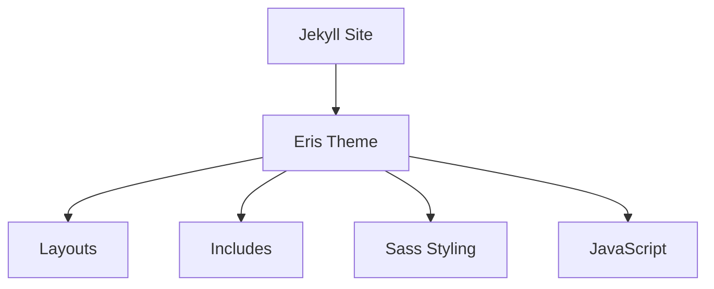

# Eris Jekyll Theme

Eris is a modern, minimalist Jekyll theme with a distinctive purple color scheme and unique border styling. It features a responsive design, dropdown navigation, social media integration, and built-in support for Mermaid diagrams.


## Installation

### As a Ruby Gem

Add this line to your Jekyll site's `Gemfile`:

```ruby
gem "eris-theme"
```

And add this line to your Jekyll site's `_config.yml`:

```yaml
theme: eris-theme
```

Then execute:

```bash
bundle install
```

### As a Remote Theme (GitHub Pages)

Add this line to your Jekyll site's `Gemfile`:

```ruby
gem "jekyll-remote-theme"
```

And add these lines to your Jekyll site's `_config.yml`:

```yaml
plugins:
  - jekyll-remote-theme

remote_theme: radicalkjax/eris-theme
```

## Usage

### Configuration

Edit your site's `_config.yml` file to customize the theme:

```yaml
# Site settings
title: "Your Site Title"
description: "Your site description"
url: "https://yourdomain.com"
baseurl: ""

# Navigation
navigation:
  - title: Blog
    url: /blog.html
  - title: Projects
    url: /projects.html
    submenu:
      - title: Project 1
        url: /projects/project1.html
      - title: Project 2
        url: /projects/project2.html
  - title: About
    url: /about.html
  - title: Contact
    url: /contact.html

# Theme color settings
theme_color:
  primary: "#6d105a"  # Primary theme color
  text: "#ffffff"     # Text color

# Social media links
social:
  bluesky: "https://bsky.app/profile/yourusername"
  linkedin: "https://www.linkedin.com/in/yourusername"
  instagram: "https://www.instagram.com/yourusername"
  github: "https://github.com/yourusername"
```

### Creating Posts

Create blog posts in the `_posts` directory with the following format:

```markdown
---
layout: post
title: "Your Post Title"
date: 2025-04-21 12:00:00 -0700
categories: jekyll theme
tags: [jekyll, theme, eris]
---

Your post content here...

```

### Creating Pages

Create pages in the root directory or in subdirectories:

```markdown
---
layout: default
title: "Your Page Title"
---

<div class="post-card">
  <h1 class="post-title">Your Page Title</h1>
  <div class="post-content">
    <p>Your page content...</p>
  </div>
</div>
```

### Mermaid Diagrams

The theme includes built-in support for Mermaid diagrams:

```markdown

```

## Customization

### Overriding Theme Files

To override any theme file, create a file with the same path in your Jekyll site:

```
your-site/
├── _includes/
│   └── header.html  # Overrides eris-theme/_includes/header.html
├── _layouts/
│   └── post.html    # Overrides eris-theme/_layouts/post.html
└── assets/
    └── css/
        └── main.scss # Extends theme CSS
```

### Custom CSS

Create a `main.scss` file in your site's `assets/css` directory:

```scss
---
---

// Import the theme
@import "eris";

// Override variables
$primary-color: #8a2be2;
$text-color: #f5f5f5;

// Add custom styles
.custom-component {
  background-color: rgba($primary-color, 0.2);
  border: 1px solid $primary-color;
  padding: 20px;
  margin: 20px 0;
  border-radius: 5px;
}
```

## Technical Details

For more detailed technical information, please refer to the [INSTALL.md](INSTALL.md) file.

## Contributing

Bug reports and pull requests are welcome on GitHub at https://github.com/radicalkjax/eris-theme.

## License

The theme is available as open source under the terms of the [MIT License](https://opensource.org/licenses/MIT).
