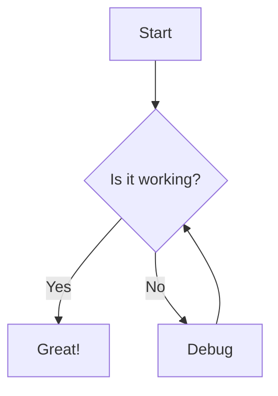

# Welcome to Eris

Eris is a modern, minimalist Jekyll theme with a distinctive purple color scheme and unique border styling. It features a responsive design, dropdown navigation, and social media integration.

## Installation

Add this line to your Jekyll site's `Gemfile`:

```ruby
gem "eris-theme"
```

And add this line to your Jekyll site's `_config.yml`:

```yaml
theme: eris-theme
```

And then execute:

```bash
$ bundle
```

Or install it yourself as:

```bash
$ gem install eris-theme
```

## Features

Eris comes with several features out of the box:

1. **Responsive Design**: Looks great on all devices, from mobile to desktop.
2. **Dropdown Navigation**: Supports multi-level navigation menus.
3. **Social Media Integration**: Easy integration with popular social media platforms.
4. **Custom Border Styling**: Distinctive border styling for a unique look.
5. **Monospace Typography**: Clean, readable typography with monospace fonts.
6. **Blog Post Layout**: Optimized layout for blog posts.
7. **Mobile-friendly Navigation**: Hamburger menu for mobile devices.
8. **Mermaid Diagram Support**: Built-in support for Mermaid diagrams.

## Mermaid Diagram Example



## Customization

You can customize the theme by overriding variables in your site's `_config.yml` file:

```yaml
# Theme color settings
theme_color:
  primary: "#6d105a"  # Change to your preferred color
  text: "#ffffff"     # Change to your preferred text color

# Social media links
social:
  bluesky: https://bsky.app/profile/yourusername
  linkedin: https://www.linkedin.com/in/yourusername
  instagram: https://www.instagram.com/yourusername
  github: https://github.com/yourusername
```

## Navigation

You can customize the navigation menu in your `_config.yml` file:

```yaml
# Navigation
navigation:
  - title: Blog
    url: /blog.html
  - title: Projects
    url: /projects.html
    submenu:
      - title: Project 1
        url: /projects/project1.html
      - title: Project 2
        url: /projects/project2.html
  - title: About
    url: /about.html
  - title: Contact
    url: /contact.html
```

## Contributing

Bug reports and pull requests are welcome on GitHub at https://github.com/radicalkjax/eris-theme.

## License

The theme is available as open source under the terms of the [MIT License](https://opensource.org/licenses/MIT).
